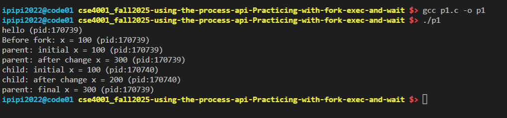
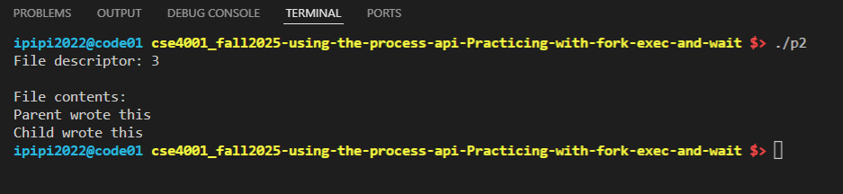
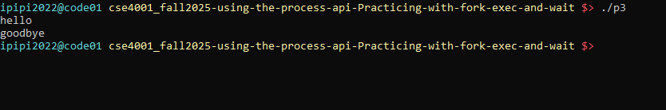
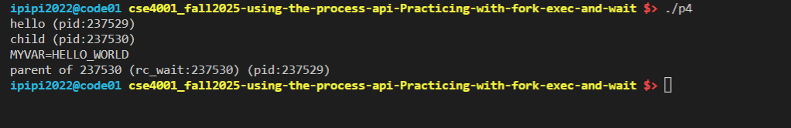
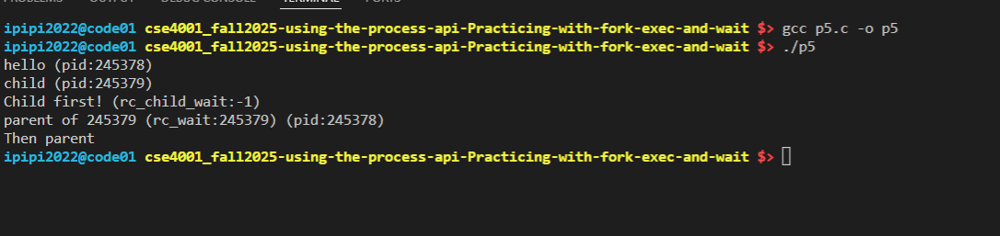
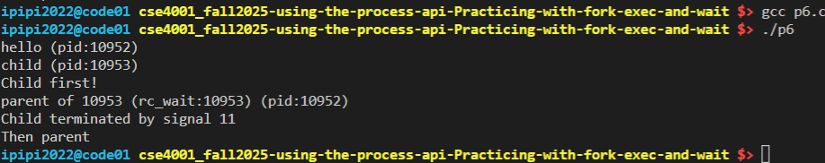
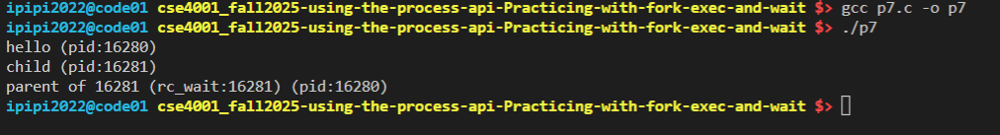

# Assignment: Practicing the Process API
Practicing with fork, exec, wait. 

### Overview

In this assignment, you will practice using the Process API to create processes and run programs under Linux. The goal is to gain hands-on experience with system calls related to process management. Specifically, you will practice using the unix process API functions 'fork()', 'exec()', 'wait()', and 'exit()'. 

⚠️ Note: This is not an OS/161 assignment. You will complete it directly on Linux. 

Use the Linux in your CSE4001 container. If you are using macOS, you may use the Terminal (you may need to install development tools with C/C++ compilers). 

**Reference Reading**: Arpaci-Dusseau, *Operating Systems: Three Easy Pieces*, Chapter 5 (Process API Basics)
 👉 [Chapter 5 PDF](http://pages.cs.wisc.edu/~remzi/OSTEP/cpu-api.pdf)

---

### **Steps to Complete the Assignment**

1. **Accept the GitHub Classroom Invitation**
    [GitHub Link](https://classroom.github.com/a/FZh4BrQG)
2. **Set up your Repository**
   - Clone the assignment repository.
3. **Study the Reference Materials**
   - Read **Chapter 5**.
   - Download and explore the sample programs from the textbook repository:
      [OSTEP CPU API Code](https://github.com/remzi-arpacidusseau/ostep-code/tree/master/cpu-api).
4. **Write Your Programs**
   - Adapt the provided example code to answer the assignment questions.
   - Each program should be clear, well-commented, and compile/run correctly.
   - Add your solution source code to the repository.

5. **Prepare Your Report**
   - Answer the questions in the README.md file. You must edit the README.md file and not create another file with the answers. 
   - For each question:
     - Include your **code**.
     - Provide your **answer/explanation**.
6. **Submit Your Work via GitHub**
   - Push both your **program code** to your assignment repository.
   - This push will serve as your submission.
   - Make sure all files, answers, and screenshots are uploaded and rendered properly.


---
### Questions
1. Write a program that calls `fork()`. Before calling `fork()`, have the main process access a variable (e.g., x) and set its value to something (e.g., 100). What value is the variable in the child process? What happens to the variable when both the child and parent change the value of x?


```cpp
// Add your code or answer here. You can also add screenshots showing your program's execution.
When the program calls fork(), the child process gets an exact copy of all the parent's variables, including their current values. In this program, since x is set to 100 before the fork, the child process will also start with x = 100. However, after the fork, the parent and child each have their own separate copy of the variable in their own memory space. When the child changes x to 200 and the parent changes x to 300, these changes are completely independent - neither process affects the other's copy of the variable. So the child's x remains 200 and the parent's x remains 300, with no interference between them.



```


2. Write a program that opens a file (with the `open()` system call) and then calls `fork()` to create a new process. Can both the child and parent access the file descriptor returned by `open()`? What happens when they are writing to the file concurrently, i.e., at the same time?

```cpp
// Add your code or answer here. You can also add screenshots showing your program's execution.
   Both parent and child can use the same file descriptor. When fork() is called, the child gets a copy of all open file descriptors.
   So if the parent has file descriptor fd = 3 open, the child also gets fd = 3 pointing to the same file.
   When both write concurrently, They share the same file position, so their writes end up one after the other in the file (not overlapping).
   


```

3. Write another program using `fork()`.The child process should print “hello”; the parent process should print “goodbye”. You should try to ensure that the child process always prints first; can you do this without calling `wait()` in the parent?

```cpp
// Add your code or answer here. You can also add screenshots showing your program's execution.
We can use sched_yeild() to voluntarily give up the cpu which allows for other process to be executed, in this case the child process. We
also added an extra delay to be certain.



```


4. Write a program that calls `fork()` and then calls some form of `exec()` to run the program `/bin/ls`. See if you can try all of the variants of `exec()`, including (on Linux) `execl()`, `execle()`, `execlp()`, `execv()`, `execvp()`, and `execvpe()`. Why do you think there are so many variants of the same basic call?

```cpp
// Add your code or answer here. You can also add screenshots showing your program's execution.  
The exec() family all do the same thing at the core.
The differences exist to make it more convenient in different situations:

l vs v:

l = list (you pass arguments as a list of parameters, execl("/bin/ls", "ls", "-l", NULL)).

v = vector (you pass arguments as an array, execv("/bin/ls", args)).

p vs no p:

p = search PATH for the program (execlp("ls", "ls", "-l", NULL) → no need for /bin/ls).

No p = you must specify the full path (/bin/ls).

e vs no e:

e = lets you specify a custom environment for the program.

No e = inherits the parent’s environment.

```


5. Now write a program that uses `wait()` to wait for the child process to finish in the parent. What does `wait()` return? What happens if you use `wait()` in the child?

```cpp
// Add your code or answer here. You can also add screenshots showing your program's execution.  
The wait from the parent returns the PID of the child process. Using the wait in the child process return -1 as shown in the screenshot below.


```

6. Write a slight modification of the previous program, this time using `waitpid()` instead of `wait()`. When would `waitpid()` be useful?

```cpp
// Add your code or answer here. You can also add screenshots showing your program's execution.
waitpid can be useful when you want to catch spefic error that occurs when the child execution fails. For instance
in our example, we were able to catach the segmention fault by signal 11.

```

7. Write a program that creates a child process, and then in the child closes standard output (`STDOUT FILENO`). What happens if the child calls `printf()` to print some output after closing the descriptor?


```cpp
// Add your code or answer here. You can also add screenshots showing your program's execution. 
The output will not be printed because the file descriptor (STDOUT_FILENO = 1) has been closed by the kernel. 

When printf() is called after closing STDOUT_FILENO:
1. printf() writes the text to its internal buffer (this succeeds)
2. When the buffer needs to be flushed, printf() calls write(1, buffer, size)
3. The write() system call fails because file descriptor 1 is no longer valid
4. The text remains in the buffer but never reaches the terminal


```

All code are numbered p1 to p7 corresponding to each problem.

